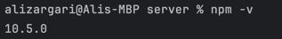
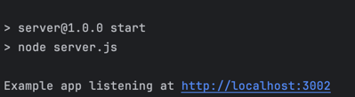
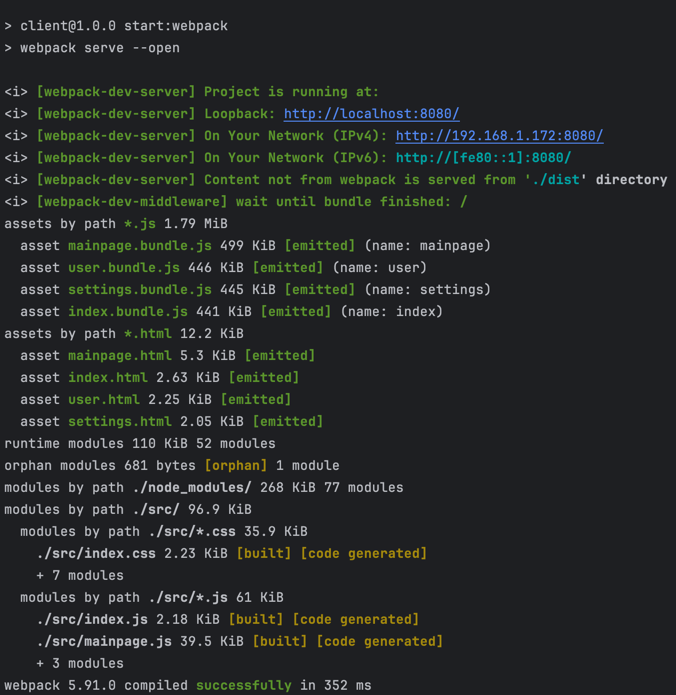
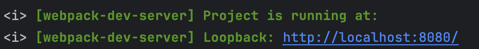
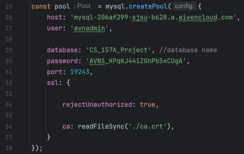
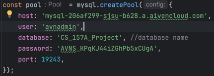

# DishSocial Guide

## IMPORTANT: **_Please read this document very carefully._**
### DishSocial is fully deployed for both front-end, and the back-end
### The Easiest way to explore DishSocial is to visit the URL below:
- #### https://ali-zargari.github.io/CS-157A-Project-DishSocial/


## Table of Contents
### 1. Local Set-up Guide
### 2. Database Connection
### 3. Division of Work

##
##


# 1. Local Set-up Guide
### The following instructions are a guide to run the front-end and the middle-layer of DishSocial locally, as requested by project specs and Dr. Moazeni.

### Summary of Steps:
1. Install Node.js
2. Install the backend
3. Install the frontend
4. Run the backend
5. Run the frontend

## Step 1: Install Node.js

### Steps to Install Node.js

1. **Visit Node.js Official Website**  
   Go to the official Node.js website: [nodejs.org](https://nodejs.org/).

2. **Choose Your Download**  
   The download page offers two options:  
   - **LTS (Long-Term Support):** Stable and recommended for most users.  
   - **Current:** Latest features that may contain experimental updates.

3. **Download Installer**  
   Click the appropriate option to download the installer for your operating system.

4. **Run the Installer**  
   Locate and open the downloaded installer file.  
   - **Windows:** Check "Add to PATH" and follow the wizard.  
   - **macOS:** Drag and drop the Node.js icon into the Applications folder.  
   - **Linux:** Refer to the Node.js installation guide [here](https://nodejs.org/en/download/package-manager/) for platform-specific steps.

5. **Verify Installation**  
   - Open your terminal or command prompt and run:
   ```bash
   node -v
   ```
   - If Node.js is installed, the version will be displayed. 



## Step 2: Install the back-end

### For Windows:

1. **Open Command Prompt**
   - Press `Win + R`, type `cmd`, and press `Enter`.

2. **Navigate to the Folder**  
   - Use the `cd` (Change Directory) command to navigate to the "Server" folder.
   - If the "Server" folder is located at `C:\...\CS_157A_Project\Server`, type:
   `cd C:\...\CS_157A_Project\Server`

3. **Run the `npm install` Command**  
   - Type the command bellow to install all the dependencies:
   ```bash
   npm install

4. **Verify Installation**  
   - Look for a `node_modules` folder in the "Server" directory to confirm that the dependencies have been installed.

### For macOS:

1. **Open Terminal**  
   - Press `Command + Space`, type `Terminal`, and press `Enter`.

2. **Navigate to the Folder**  
   - Use the `cd` (Change Directory) command to navigate to the "Server" folder.
   - If the "Server" folder is located at `/Users/your-username/Projects/CS_157A_Project/Server`, type:
   `cd /Users/your-username/Projects/CS_157A_Project/Server`

3. **Run the `npm install` Command**  
   - Type the command below to install all the dependencies:
   ```bash
   npm install

4. **Verify Installation**  
   - Look for a `node_modules` folder in the "Server" directory to confirm that the dependencies have been installed.


## Step 3: Install the front-end

#### - this is the same process as step 2, but repeated in the Client folder.

### For Windows:

1. **Open Command Prompt**
   - Press `Win + R`, type `cmd`, and press `Enter`.

2. **Navigate to the Folder**  
   - Use the `cd` (Change Directory) command to navigate to the "Server" folder.
   - If the "Server" folder is located at `C:\...\CS_157A_Project\Client`, type:
   `cd C:\...\CS_157A_Project\Client`

3. **Run the `npm install` Command**  
   - Type the command bellow to install all the dependencies:
   ```bash
   npm install

4. **Verify Installation**  
   - Look for a `node_modules` folder in the "Server" directory to confirm that the dependencies have been installed.

### For macOS:

1. **Open Terminal**  
   - Press `Command + Space`, type `Terminal`, and press `Enter`.

2. **Navigate to the Folder**  
   - Use the `cd` (Change Directory) command to navigate to the "Server" folder.
   - If the "Server" folder is located at `/Users/your-username/Projects/CS_157A_Project/Client`, type:
   `cd /Users/your-username/Projects/CS_157A_Project/Client`

3. **Run the `npm install` Command**  
   - Type the command below to install all the dependencies:
   ```bash
   npm install

4. **Verify Installation**  
   - Look for a `node_modules` folder in the "Server" directory to confirm that the dependencies have been installed.


## Step 4: Run the back-end

- Using the Command Prompt (windows) or Terminal(mac), navigate to the **Server** folder
- Type the following command and press enter:
   ```bash
   npm run start
- This is a custom command that is set in 'package.json'.
- If successful, the following output will be displayed:



## Step 5: Run the front-end
- #### Important: This app is best displayed on Edge, Chrome, or Safari. It has **'NOT'** been tested on other browsers.
- Using the Command Prompt (windows) or Terminal(mac), navigate to the **Server** folder
- Type the following command and press enter:
   ```bash
   npm run start:webpack
- This is a custom command that is set in 'package.json'.
- If successful, the following output will be displayed, and the front-end page should open on the browser:

- If the app opens on Edge, Chrome, or Safari then it is good to go.
- If the app does not open on one of the 3 mentioned browsers (or at all), copy the URL that was displayed when running 'npm run start:webpack'
npm run start:webpack
- Open either Edge, Chrome, or Safari and visit that URL.

##
##

# 2. Database Connection

## Connecting to the Database
- #### Important: The database for DishSocial is hosted online. 
In order to test the insert commands, there are 2 options:
  1. **To recreate our database locally and insert**.
  2. **To connect to our online database**
####
Here are steps for both the above scnarions:

### 1. Recreating the database Locally:
  1. Navigate to the Server directory
  2. Open server.js:
     1. go to line 25, and find the following code fragment:
     2. 
     3. Change host, user, database, password, and port numbers accordingly to your own database' credentials. 
        1. If not using SSL, remove the ssl parameter all-together. 
        2. In other words, remove lines 32-37 in the image
        
  3. **RE-RUN server.js:  Ctrl-C out of it if the server is still running, then retype 'npm run start' in the Server folder**
  4. Dish Social is now connected to your own local database.

### 2. Connecting to our online database using your own IDE:
    host: 'mysql-206af299-sjsu-b628.a.aivencloud.com',
    user: 'avnadmin',
    database: 'CS_157A_Project', //database name
    password: 'AVNS_KPqKJ44iZGhPb5xCUgA',
    port: 19243,
    ssl: {

        rejectUnauthorized: true,

        ca: readFileSync('./ca.crt'),
    }


#
# 3. Division of Work